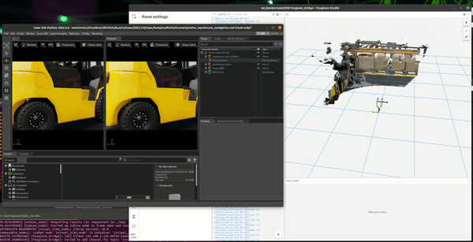
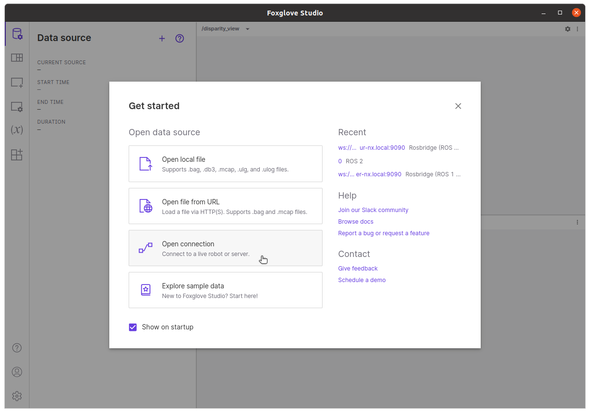

# isaac_demo

A combined set of demo working with Isaac SIM on a workstation and Isaac ROS on a NVIDIA Jetson AGX Orin

## Hardware required

Workstation:

1. x86/64 machine
2. Install Ubuntu 20.04
3. NVIDIA Graphic card with RTX
4. Display
5. Keyboard and Mouse

NVIDIA Jetson:

1. NVIDIA Jetson AGX Orin
2. Jetpack 5.0.2

Tools:

1. Router
2. eth cables

# Install

There are two steps to follow, Install FoxGlove and Install Isaac ROS

## Foxglove

Download the latest [foxglove](https://foxglove.dev/download) version for ARM64

```console
sudo apt install ./foxglove-studio-*.deb
sudo apt update
sudo apt install -y foxglove-studio
```

## Isaac SIM and Isaac DEMO

Clone this repository and move

```console
git clone https://github.com/rbonghi/isaac_demo.git
cd isaac_demo
```

Run the installer

```console
./isaac_demo.sh
```

# Run demo

From your workstation now you need to do two extra steps

## Setup foxglove

1. Open foxglove
2. Set up **Open connection**



3. Select **ROS2** and **Open**


## Run simulation on Jetson

If you are on NVIDIA Jetson AGX Orin you will see start a new terminal inside a docker image, run the command below

```console
bash src/isaac_demo/scripts/run_in_docker.sh
```

Well done! Now all demo is running!
