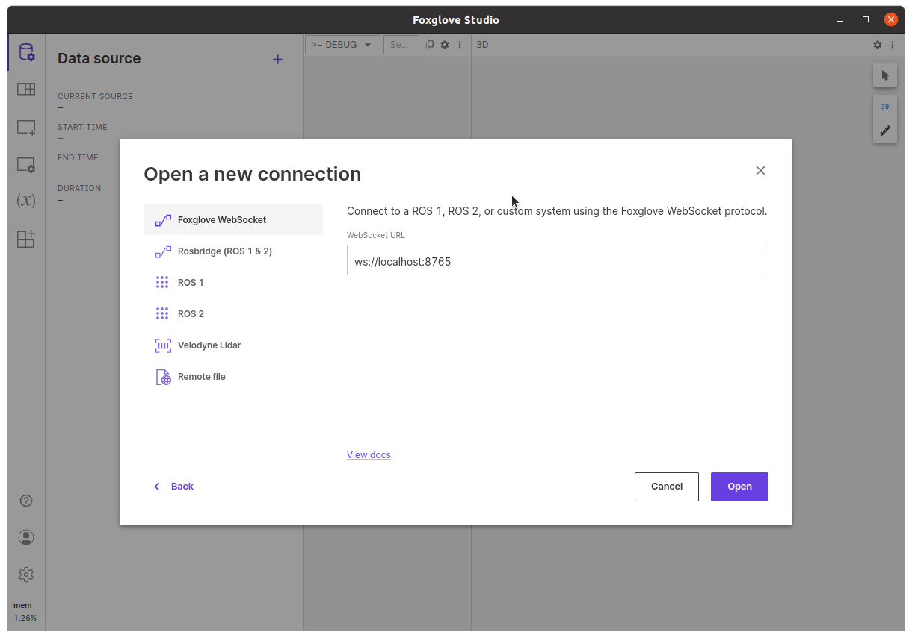

# isaac_demo


A combined set of demo working with Isaac SIM on a workstation and Isaac ROS on a NVIDIA Jetson AGX Orin

## Hardware required

Workstation:

1. Internet connection
2. x86/64 machine
3. Install Ubuntu 20.04
4. NVIDIA Graphic card with RTX
5. Display
6. Keyboard and Mouse

NVIDIA Jetson:

1. NVIDIA Jetson AGX Orin
2. Jetpack 5.1.2

Tools:

1. Router
2. eth cables

## Setup hardware

Before to start check you have all requirements and connect the driver following this image


It is preferable to connect workstation and the NVIDIA Jetson AGX Orin with a lan cable and not use WiFi.

## Install

There are two steps to follow, Install FoxGlove and Install Isaac ROS

Follow:

* Install on Jetson
* Install on workstation

### Install on NVIDIA Jetson Orin

Install on your NVIDIA Jetson Orin [Jetpack 5+](https://developer.nvidia.com/embedded/jetpack)

After installation save IP address and hostname

#### Connect remotely

In this section you connect to your NVIDIA Jetson with a ssh connection, open a terminal an write

```console
ssh <IP or hostname.local>
```

where **IP** is the of NVIDIA Jetson or **hostname** is the hostname of your board.

If you are connected the output from the terminal is:


#### Install Isaac Demo

Clone this repository and move to repository folder

```console
git clone https://github.com/rbonghi/isaac_demo.git
cd isaac_demo
```

Add docker group to your user

```console
sudo usermod -aG docker $USER && newgrp docker
```

Set the default nvidia runtime

You're going to be building containers, you need to set Docker's `default-runtime` to `nvidia`, so that the NVCC compiler and GPU are available during `docker build` operations.  Add `"default-runtime": "nvidia"` to your `/etc/docker/daemon.json` configuration file before attempting to build the containers:

``` json
{
    "default-runtime": "nvidia",
    "runtimes": {
        "nvidia": {
            "path": "nvidia-container-runtime",
            "runtimeArgs": []
        }
    }
}
```

Then restart the Docker service, or reboot your system before proceeding:

```console
sudo systemctl restart docker
```

Run the installer

```console
./isaac_demo.sh
```

If everything is going well (need time before to be done) the terminal will show this output


### Install on workstation

In this first part, you install different software on your workstation.

* NVIDIA Isaac SIM
* Foxglove
* This repository

#### NVIDIA Isaac SIM

Follow the documentation on NVIDIA Isaac SIM [Workstation install](https://docs.omniverse.nvidia.com/app_isaacsim/app_isaacsim/install_workstation.html)

1. Download the [Omniverse Launcher](https://www.nvidia.com/en-us/omniverse/)
2. [Install Omniverse Launcher](https://docs.omniverse.nvidia.com/prod_launcher/prod_launcher/installing_launcher.html)
3. Install [Cache](https://docs.omniverse.nvidia.com/prod_nucleus/prod_utilities/cache/installation/workstation.html) from the Omniverse Launcher
4. Install [Nucleus](https://docs.omniverse.nvidia.com/prod_nucleus/prod_nucleus/workstation/installation.html) from the Omniverse Launcher

Open Omniverse Launcher


Move to Library and choice "Omniverse Isaac SIM" and download the latest 2022.2 version


#### Foxglove on Desktop

Download the latest [foxglove](https://foxglove.dev/download) version for your desktop

```console
sudo apt install ./foxglove-studio-*.deb
sudo apt update
sudo apt install -y foxglove-studio
```

#### Isaac SIM and Isaac DEMO

Clone this repository and move to repository folder

```console
git clone https://github.com/rbonghi/isaac_demo.git
cd isaac_demo
```

Now follow the Run demo to start the simulation

## Run demo

From your workstation now you need to do two extra steps

### Start Isaac SIM

Start the NVIDIA Isaac SIM from script

Open a terminal on your workstation and write

```console
cd isaac_demo
./isaac_demo.sh
```

Now this script initialize and run NVIDIA Isaac SIM, after a while you see a new window with Isaac SIM running


After this step you can complete to run the demo on your NVIDIA Jetson.

### Run simulation on Jetson

If you close your terminal on the installation, you can reopen with:

```console
ssh <IP or hostname.local>
```

where **IP** is the of NVIDIA Jetson or **hostname** is the hostname of your board.

and run

```console
cd isaac_demo
./isaac_demo.sh
```

Wait this script run the docker terminal, like the image below


Now you can run the script below

```console
bash src/isaac_demo/scripts/run_in_docker.sh
```

if you are planning to use Foxglove please run the same script with option `--foxglove`

```console
bash src/isaac_demo/scripts/run_in_docker.sh --foxglove
```

Well done! Now the Isaac ROS is running on your Jetson

### Setup foxglove

1. Open foxglove
2. Set up **Open connection**


3. Select **Foxglove WebSocket** and **Open**



4. Write on **WebSocket URL**

```console
ws://<IP or hostname.local>:8765
```

where **IP** is the of NVIDIA Jetson or **hostname** is the hostname of your board.

5. Setup Layout

Press on "Import layout" icon and after on top press the button **Import layout**


Select the layout on: **isaac_demo/foxglove/Default.json**

6. Output running


You can drive the robot directly from the foxglove joystick

## Troubleshooting

If Isaac SIM on your workstation show this message


just wait! :-)
